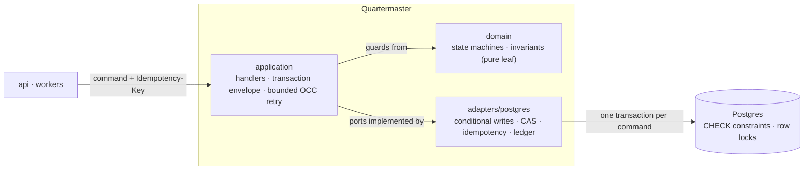

# Quartermaster

[](https://github.com/JumpTechCode/quartermaster/actions/workflows/ci.yml)
[](https://github.com/JumpTechCode/quartermaster/actions/workflows/codeql.yml)

Quartermaster is a warehouse inventory engine that aims to stay correct under
concurrent load. It models stock held at shelf and bin locations, driven by
inbound (receiving and putaway) and outbound (allocate, pick, pack, ship)
document flows. Every command is idempotent, two state machines decide which
transitions are legal, and the inventory invariants — stock never negative,
reservations never exceeding stock, no SKU oversold, the books in balance — are
enforced by the database under real concurrent traffic.

## Status

The V1 feature set is implemented: the domain model and two state machines, the
Postgres persistence layer with its conditional-write guards and exactly-once
idempotency store, the command handlers and HTTP API, the background workers
(reservation reaper, backorder sweep, idempotency-key reaper), and the
correctness-under-load harness with its invariant oracle. The repository builds
and is tested under CI. It is young software — interfaces may still change, and
it has not yet seen production use. See [Scope](#scope) for the precise
boundaries of what V1 does and does not cover.

## Why this shape

Inventory systems are easy to write as CRUD and hard to keep correct when many
commands contend for the same stock at once. Quartermaster concentrates on that
contended core: the guarantees are meant to hold because a real relational
database enforces them, not because the application remembers to check. A load
harness is part of the design so the behaviour under contention can be measured
rather than asserted.

## Domain model

Stock is tracked per `(SKU, location)` as `qty_on_hand` and `qty_reserved`,
where `available = qty_on_hand − qty_reserved`.

- **Allocating** an order raises `qty_reserved` (guarded by `available ≥ n`)
  without moving stock.
- **Picking** consumes a reservation, lowering both `qty_on_hand` and
  `qty_reserved`.
- **Cancel, expiry, and returns** release a reservation or restock on-hand.

Two invariant tiers back this up. Storage-level `CHECK` constraints make
over-decrement and over-reserve impossible locally; an append-only `movement`
ledger makes conservation auditable — for each SKU, the inbound total minus the
outbound total equals current on-hand.

## State machines

Two documents govern the legal transitions, with partiality carried at the line
level:

- **Receipt (inbound):** `expected → arrived → receiving → received →
  putaway_complete → closed`, with partial receipts (short shipments) recorded
  on the lines. The same lifecycle serves both supplier receipts and customer
  returns (RMAs); returned stock physically arrives, is received, and is put
  away rather than teleported back onto a shelf.
- **Order (outbound):** `created → allocated → picking → picked → packed →
  shipped → closed`, with a `backordered` branch when stock is short and a
  `cancelled` branch before shipping. A background sweep re-allocates
  backordered lines as stock is put away.

Transition tables live in the pure domain layer and are enforced atomically at
the database with guarded updates.

## Concurrency model

Every mutation is a command carrying an `Idempotency-Key` and runs as a single
database transaction: claim the key, guard the state transition, apply the
invariant-guarded stock change, append to the ledger, and store the response —
all committed together.

- **Stock** uses invariant-guarded conditional writes (the `WHERE` clause is the
  guard), so non-violating decrements succeed under a row lock and only genuinely
  insufficient ones fail — no version-column retry storm on hot rows.
- **Documents** use a state/version compare-and-swap with bounded retry.
- **Idempotency** is exactly-once: a duplicate key blocks on the unique index and
  then replays the stored response. Successes and hard rejections are cached;
  transient business failures roll back so a later retry can still succeed.

`READ COMMITTED` is sufficient on the hot paths because the conditional `WHERE`
re-checks the locked, committed row — there is no read-modify-write gap.

## Architecture

Ports and adapters with a pure domain core and mechanically enforced
boundaries.



`domain` imports nothing internal; `application` imports `domain` and defines
the ports; `adapters` implement them; `api` and `workers` drive `application`;
only `app.py` imports concrete implementations. These edges are enforced in CI
by [import-linter](https://import-linter.readthedocs.io/) contracts, so the
dependency graph is checked rather than merely documented.

## Project layout

```
src/quartermaster/
  domain/        pure: entities, transition tables + guards, invariants, errors
  application/   command handlers + transaction envelope; declares repository ports
  adapters/
    postgres/    port implementations: conditional-update SQL, CAS, idempotency, ledger
  api/           FastAPI routes, Idempotency-Key handling, error mapping
  workers/       polled background workers: reservation reaper, backorder sweep, key reaper
  config/        settings
  app.py         composition root (the only module that wires concretes)
migrations/      Alembic
tests/           unit (pure domain) and integration (real Postgres)
loadtest/        the correctness-under-load harness
```

## Testing

Three complementary pillars:

1. **Stateful property testing** with Hypothesis generates valid command
   sequences and asserts the invariants after every step, shrinking any failure
   to a minimal reproducer — alongside exhaustive table-driven tests of the
   transition guards.
2. **Concurrency integration tests** against a real Postgres assert each race
   directly: N concurrent allocates on M available stock succeed exactly M
   times; one idempotency key fired K times has exactly one effect; concurrent
   picks never go negative.
3. **A load harness** drives a high-concurrency mixed workload at hot SKUs,
   injects duplicate and retried commands, and runs an invariant oracle over the
   result and the ledger. A deterministic, scaled-down run gates every pull
   request; the full sweep runs on demand.

### Comparative sweep

The harness varies exactly one primitive — `StockRepo.reserve_up_to` — across
three strategies, keeping the handler, transaction envelope, ledger, and oracle
identical. The `naive` run is a falsification control: it uses an unguarded
read-modify-write that passes all storage `CHECK` constraints but loses updates
under concurrency; its oracle `FAIL` confirms the oracle would have caught a
violation in the other two runs. `read_cas` is a value-compare-and-swap
(correct, but retries under contention); `guarded` is the production
conditional-write primitive.

Figures below are from one measured run on a developer laptop (Apple M3, 8 GB
RAM; Postgres 17 in Docker), driving 2,000 allocations at concurrency 128
against four hot cells — the worst case, where every command contends for the
same handful of rows. They are illustrative — throughput varies with hardware —
but the qualitative result is the property that matters: `naive` oversells,
`guarded` and `read_cas` do not.

```
  strategy    thrpt/s    p50ms    p99ms  retries  exhaust  oversell  oracle
---------------------------------------------------------------------------
     naive        636    162.8    557.1        0        0      3080    FAIL
  read_cas        374    282.7   1152.4     3496      344         0      OK
   guarded        742    146.0    407.9        0        0         0      OK
```

Under this contention the strategies separate cleanly. `naive` is quick but
wrong: it silently oversells by 3,080 units, and the oracle's
`conservation_reserved` check fails — the falsification control firing exactly
as designed, which is what gives the two green results their meaning. `read_cas`
is correct but pays for it, thrashing through 3,496 OCC retries and exhausting
its retry budget on 344 commands (each a `503` in production) at roughly half the
throughput. `guarded`, the production conditional-write primitive, is both
correct and fastest: no retries, no exhaustion, no oversell.

The same guarded workload driven by four OS processes rather than one async
event loop (asyncpg pools are not fork-safe, so each process builds its own)
keeps the oracle green with zero oversell — correctness holds under genuine
multi-core parallelism, not only single-loop concurrency. Aggregate throughput
there is bound by row-lock contention on the hot cells; spreading the same load
across more cells is what lets the extra processes pay off.

The full on-demand sweep:

```sh
uv run python -m loadtest \
  --database-url "postgresql+asyncpg://user:pw@localhost:5432/qm" \
  --skus 4 --orders 2000 --on-hand 500 --concurrency 128
```

## Development and checks

Requires [uv](https://docs.astral.sh/uv/) and Python 3.13.

```sh
make sync      # install the project and dev dependencies
make verify    # run the full set of CI gates locally

# Or individually:
make lint       # ruff format check + lint
make typecheck  # mypy --strict
make imports    # import-linter boundary contracts
make cover      # pytest with the coverage threshold
make audit      # pip-audit dependency scan
```

`make verify` runs the same gates CI enforces: ruff, mypy in strict mode,
import-linter boundary contracts, the pytest suite with a coverage threshold of
at least 80%, and a pip-audit dependency scan. CI additionally runs
[CodeQL](.github/workflows/codeql.yml) static analysis.

## Scope

In scope for V1:

- One warehouse; aggregate stock per `(SKU, location)`.
- Receipt lifecycle including partial receipts.
- Order lifecycle including reservations with expiry, partial fulfilment,
  backorders, cancellations, and returns (as inbound RMA documents).
- Idempotent, exactly-once commands and the full invariant set verified under
  load.
- A correctness-under-load harness with an invariant oracle.

Not in scope yet — deliberate, documented boundaries:

- Lots, serial numbers, and license plates (pallets).
- Multiple warehouses, replenishment, and slotting.
- Wave or batch picking and pick-path optimization.
- Allocation strategy beyond simple greedy (a routing concern for a layer above
  this engine).
- Carrier and label integration, labor management, and a user interface.

## Design decisions

Significant, hard-to-reverse choices are recorded as
[architecture decision records](docs/adr) in Michael Nygard's format.

## Contributing

See [CONTRIBUTING.md](CONTRIBUTING.md) for the development workflow and the
checks every pull request must pass. Security issues should be reported
privately as described in [SECURITY.md](SECURITY.md).

## License

Licensed under the [Apache License 2.0](LICENSE).
